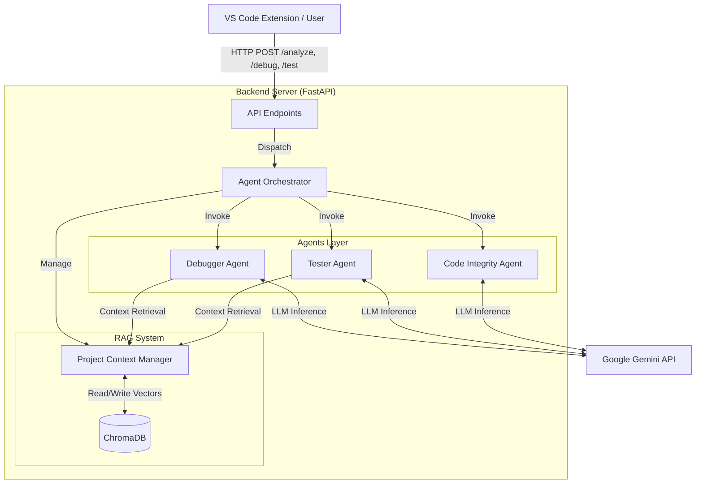

# System Architecture

The following diagram illustrates the high-level architecture of the AI-Powered Software Engineering Tool.

## Component Description

1.  **Client**: The interface (VS Code Extension or HTTP Client) sending code analysis requests.
2.  **API Layer**: Python FastAPI server handling HTTP requests and routing them to the orchestrator.
3.  **Agent Orchestrator**: Central controller that manages the lifecycle of agents and context retrieval.
4.  **Agents**: Specialized AI agents powered by LLMs (Google Gemini) to perform specific tasks:
    *   **Debugger**: Analyzes errors and code to suggest fixes.
    *   **Tester**: Generates unit tests.
    *   **Integrity**: Checks for code quality and security issues.
5.  **RAG System**: Retrieval-Augmented Generation module.
    *   **Project Context**: Manages file ingestion and query retrieval.
    *   **ChromaDB**: Vector database storing embeddings of the project's codebase for efficient context matching.
6.  **External**: Google Gemini API provides the generative capabilities for the agents.
