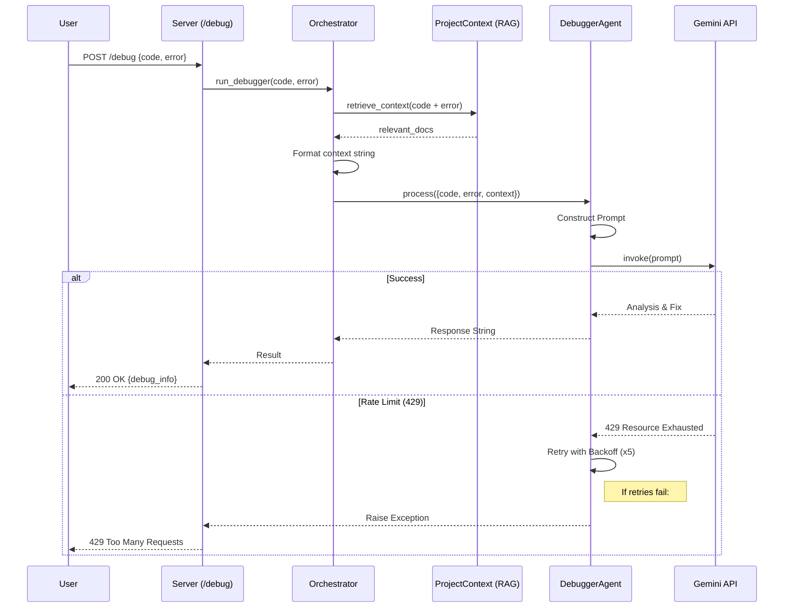

# Debug Process Flow

The following diagram illustrates the flow of a request to the `/debug` endpoint.

## detailed Steps

1.  **Request**: User sends code and error message to `/debug`.
2.  **Orchestration**: `AgentOrchestrator` receives the request.
3.  **Context Retrieval**: `ProjectContext` searches the vector database for relevant existing code or docs.
4.  **Agent Execution**: `DebuggerAgent` prepares the prompt with code, error, and retrieved context.
5.  **LLM Call**: The agent calls Google Gemini API.
    *   **Retry Logic**: The agent has built-in retry logic for transient errors or rate limits (exponential backoff).
6.  **Response**: The analysis and suggested fix are returned to the user.
