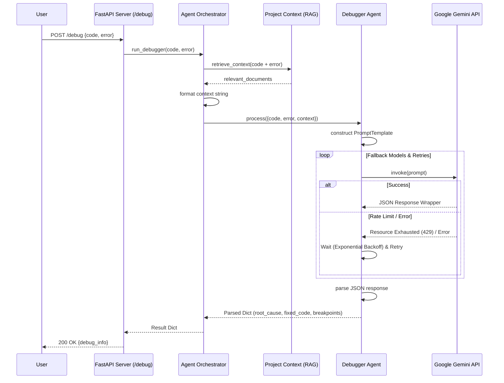

# AI-Powered Software Engineering Tool - Diagrams

## 1. System Architecture Diagram

This diagram illustrates the comprehensive high-level architecture of the system, including all currently implemented agents.

```mermaid
graph TD
    Client[VS Code Extension / HTTP Client]
    
    subgraph "Backend Server (FastAPI)"
        API[API Endpoints: /analyze, /debug, /test, /ingest]
        Orch[Agent Orchestrator]
        
        subgraph "Agents Layer"
            Debug[Debugger Agent]
            Test[Tester Agent]
            Integrity[Code Integrity Agent]
            Editor[File Editor Agent]
            MultiFile[Multi-File Analysis Agent]
        end
        
        subgraph "RAG System"
            Context[Project Context Manager]
            VectorDB[(ChromaDB)]
        end
    end
    
    External[Google Gemini API]

    %% Client Interactions
    Client -->|HTTP POST| API
    
    %% API to Orchestrator
    API -->|Dispatch Requests| Orch
    
    %% Orchestrator to Agents
    Orch -->|Invoke| Debug
    Orch -->|Invoke| Test
    Orch -->|Invoke| Integrity
    Orch -.->|Internal Invoke| Editor
    Orch -.->|Internal Invoke| MultiFile
    
    %% Context Management
    Orch -->|Manage/Retrieve| Context
    Context <-->|Read/Write Vectors| VectorDB
    
    %% Agent to LLM
    Debug <-->|LLM Inference (w/ Fallback)| External
    Test <-->|LLM Inference (w/ Fallback)| External
    Integrity <-->|LLM Inference (w/ Fallback)| External
    Editor <-->|LLM Inference (w/ Fallback)| External
    MultiFile <-->|LLM Inference (w/ Fallback)| External
```

## 2. Sequence Diagram (Debug Flow)

This sequence diagram outlines the process of a typical request, using the `/debug` endpoint as an example.


